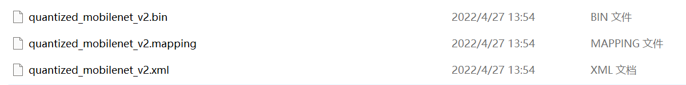

# ResNet50_INT8_OpenVINO™
#### 1. 项目功能

项目主要功能实现通过OpenVINO™中的POT工具，将ResNet50模型转为INT8格式。


#### 2. 源码实现

项目实现源码已经放置在python文件夹下，获取源码后，对以下位置进行修改：

- 模型信息

	```python
	model_config = Dict({
	    'model_name': 'flower_clas',
	    'model': "E:\\Text_Model\\flowerclas20220427\\flower_clas.xml",
	    'weights': "E:\\Text_Model\\flowerclas20220427\\flower_clas.bin"
	})
	```

将该字典中的模型信息修改为自己本地地址。

- 测试数据信息

	```python
	dataset_config = {
	    'data_source': "E:\\Text_dataset\\flowers102\\val_list.txt",
	    'path': "E:\\Text_dataset\\flowers102\\"
	}
	```

将测试数据集修改为本地数据位置

运行main_resnet50_int8_openvino.py文件，进行模型转换，结果如下：

```python
Load the model.
Initialize the data loader.
Initialize the metric.
Initialize the engine for metric calculation and statistics collection.
 Create a pipeline of compression algorithms.
Execute the pipeline.
 Compress model weights quantized precision
Save the compressed model to the desired path.
Accuracy of the original model: accuracy@top1: 0.0
Accuracy of the optimized model: accuracy@top1: 0.0
Compare accuracy of the original and quantized models.
```

转换后的模型在D盘根目录下：



